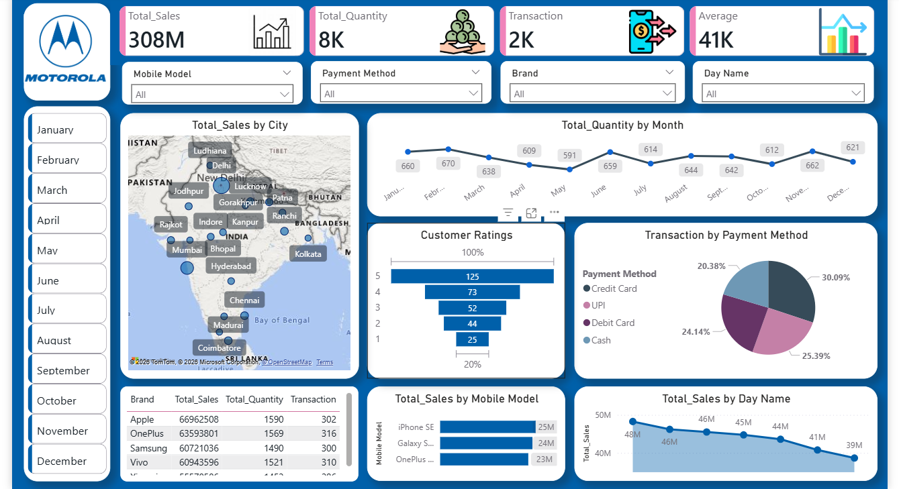

# mobile-sales-dashboard
Power BI dashboard for mobile sales analysis using Excel dataset

# 📊 Mobile Sales Dashboard

## 📌 Overview

This Power BI dashboard analyzes mobile sales data using Excel dataset.

## 📊 Key Features

* Total Sales: 308M
* Total Quantity: 8K
* Transactions: 2K
* Average Sales: 41K

## 📈 Insights

* Metro cities generate highest sales
* Credit Card & UPI most used payment methods
* Top brands: Apple, Samsung, OnePlus

## 🛠 Tools Used

* Excel
* Power BI

## 📸 Dashboard Preview

## 📂 Files

* Dashboard.pbix
* Dataset (Excel)

## 👨‍💻 Author

Hariom Chikane
